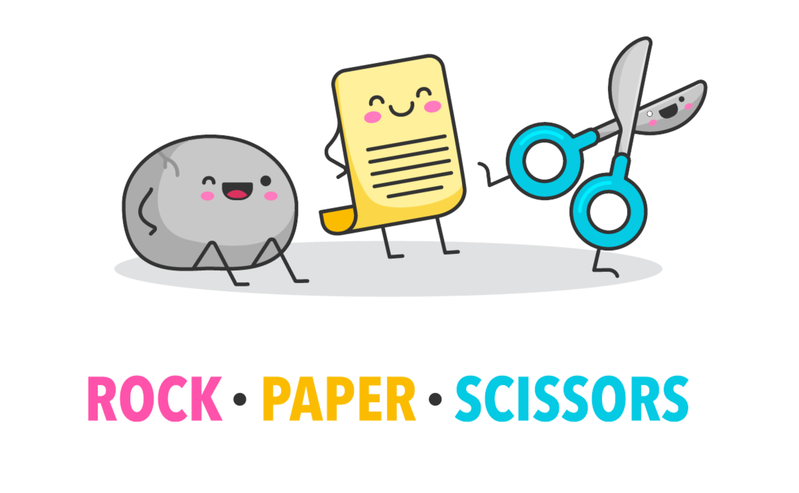

<p align="center">
</a>
</p>
<br>

# Rock Paper Scissors Game

The objective of this Rock, Paper, Scissors game is to make a simple game with very minimum CSS.

## Technologies

- JavaScript
- HTML5
- CSS

## Instrucions to Play

- Choose between Rock, Paper or Scissors by clicking in the button.
- Rock beats Scissors.
- Scissors beats Paper.
- Paper beats Rock.
- Play again!

## Lessons

- How to use JavaScript conditionals
- Create new functions
- Use Math.random()
- Practice algorithmic thinking

## Run

Install dependencies

```bash
  npm install
```

Init the task runner

```bash
  npm init-project
```

Start the server and play!

```bash
  npm run watch
```

## Authors

:woman: [@marcelaos](https://github.com/marcela-os)
